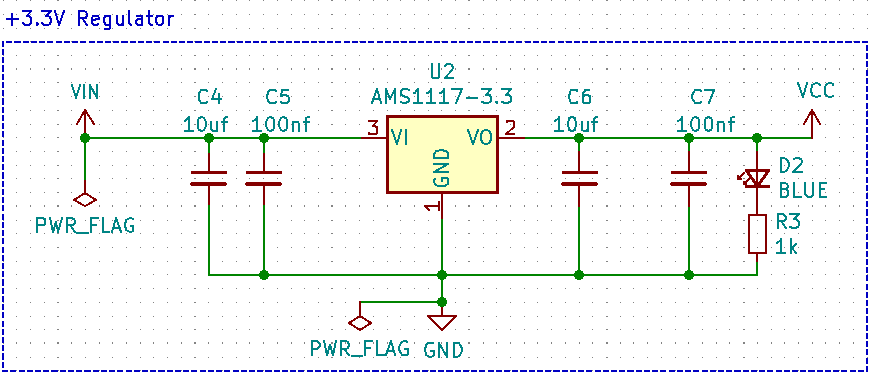
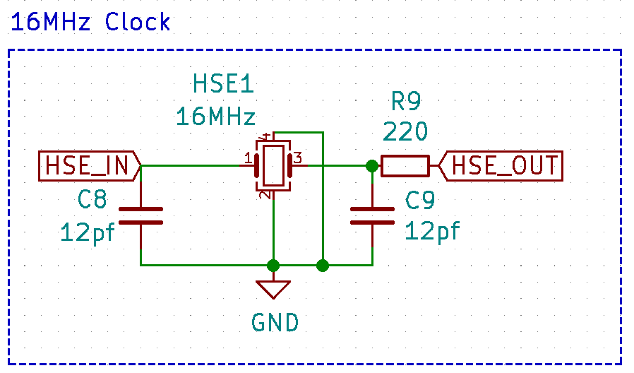
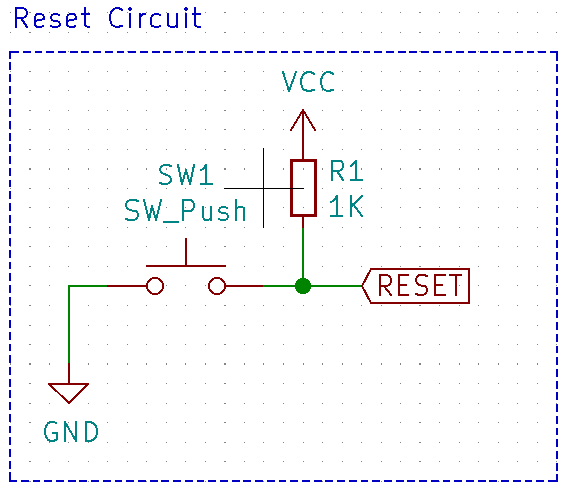
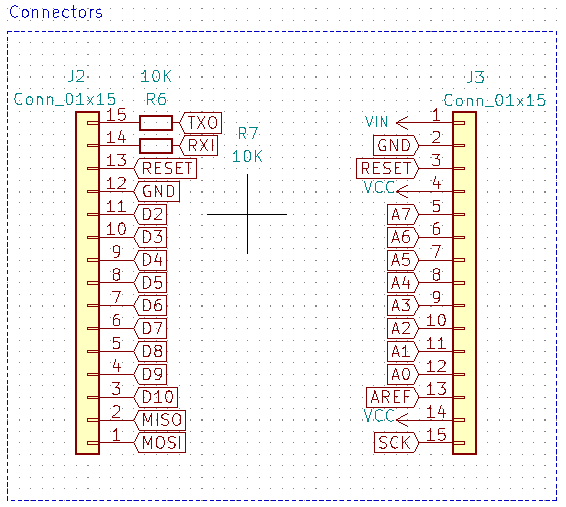
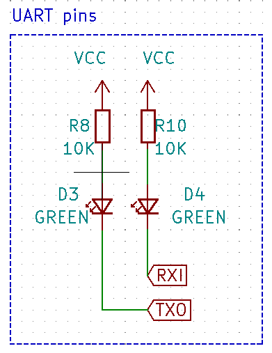
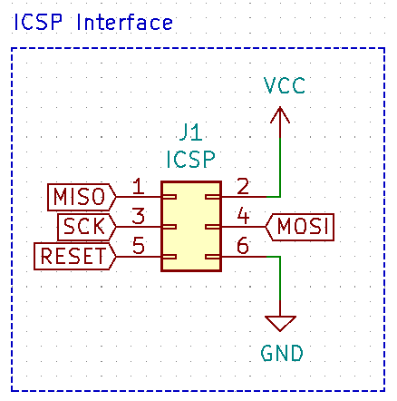
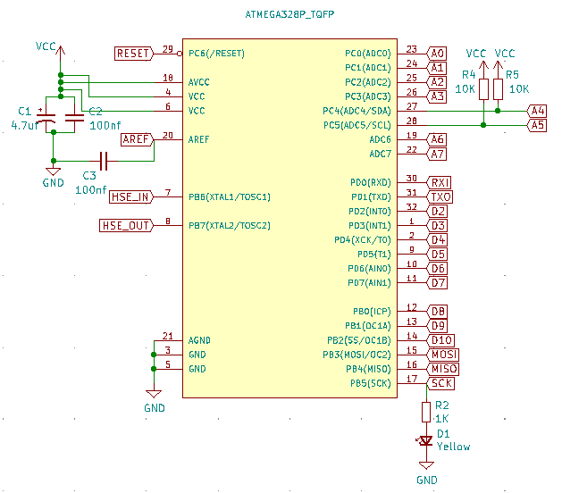
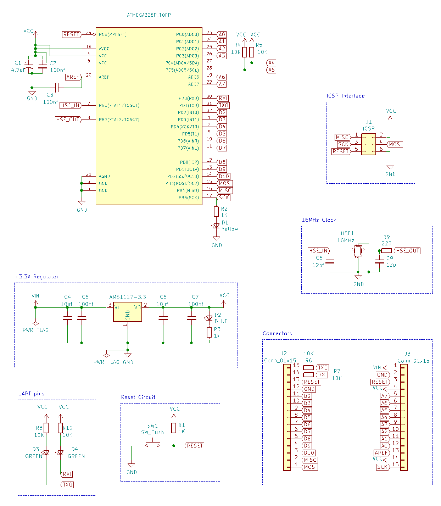
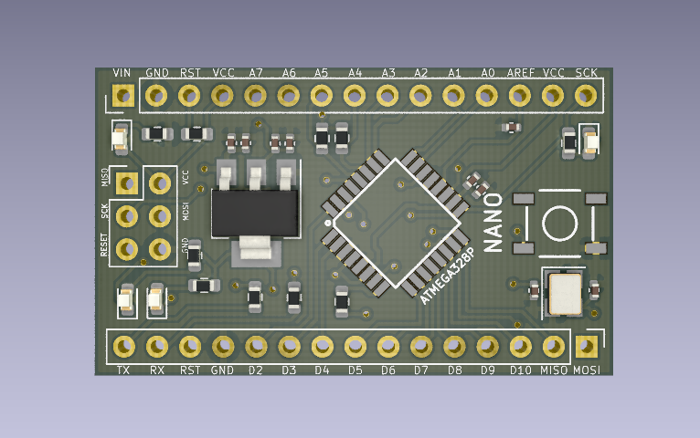
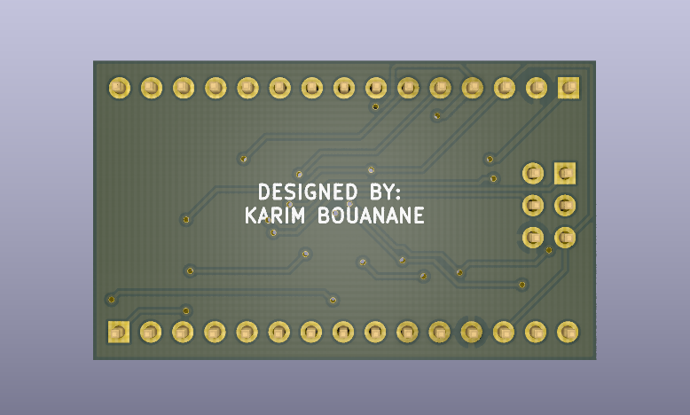

# **KiCAD-Custom-Arduino-Board-Design**

## **What is expected from this project ?**

This project goal was to touch the fundamental basis, from design to fabrication process of the PCB board. That's why I decided to build my own custom Arduino Nano Board from scratch using the KiCAD software which is totally free and offers many great tools. 
However due to my lack of some knowledge in electricity and the pressed time, I decided to give up some enhancements and postpone them when I finish my studies.

## **Subsystems**

## Voltage Regulator

I used the famous AMS117-3.3 voltage regulator known by its low cost and its availibity in the market. This IC can support a wide range of input voltage (4.0 up to 12V) and can deliver 3.3V with 1A output current capability. Its maximum drop out voltage can reach 1.3V.

The placement and values of capacitors were used from the datasheet. In addition I've added the Power On LED to lighten up when power is available.

## Oscillator

Ceramic and crystal oscillators are the main clock source and each has many types. The choice was mainly based on the frequency accuracy which provide each of them. Crystal Oscillator provides much more accurate output, of about 30 to 50ppm (part per million), than the Ceramic resonator which has +-1% of accuracy. The one I used for the atmega328 has a tolerance of 20ppm with a frequency of 16Mhz. The below circuit schema was made following the indication of datasheet.

## RESET pin

The reset pin is active low, so it needs a pull up resistor and I've added a switch button to put microcontroller in reset state manually in order to program it.

## Connectors

They are the interface we use to access the pins of the ATMEGA328P. The through whole connectors I used are the same as the ones on the Arduino Nano, they come ina single vertical row of 15 connectors with a size of 2.5mm. 

## UART pins

In order to observe any ongoing communication in the UART pins (RX, TX), I put two LEDS with a high resistance value.

## ICSP Interface

ICSP stands for In Circuit Serial Programming, which represents one of the several methods available for programming Arduino boards. Ordinarily, an Arduino bootloader program is used to program an Arduino board, but if the bootloader is missing or damaged, ICSP can be used instead. The ICSP uses pins of the SPI interface which are MISO, MOSI, SCK. 

## ATMEGA328P

### I2C pull up resistors

I2C peripheral uses open-drain pins so all they can do is assert the lines low, and pullup resistors pull the line high when it is not driven low. Also the pull-ups can be different values for different I2C speeds so they have to be external for that flexibility. I choosed the same value as like the ones used in Arduino Nano.

### AVCC low pass filter

So as to gain more accuracy in analogic operations, the data sheet for the ATMEGA328 chip says that AVCC should be connected externally to VCC via a low-pass filter if low noise is important to our application.

### User LED

This LED is attached to pin 13 and is built in most of the boards. It's not used by microcontroller but is there for the user to control. 

## **Whole Schemtaic**

## **3D front view**

## **3D back view**

## **References :**

Very informative references that I used:

- The official open source schematic published by arduino.cc

- This amazing website which thought me almost everything about every subsystem used in arduino with great explanation : https://rheingoldheavy.com/arduino-from-scratch-series/

- This is a concise playlist for using KiCAD software made by the incredible teacher Shawn Hymel which has a fun and attractive style of teaching : https://www.youtube.com/watch?v=vaCVh2SAZY4&list=PL3bNyZYHcRSUhUXUt51W6nKvxx2ORvUQB

- My selection of components was based on this list of parts that offer JLCPCB manufacturer:  https://jlcpcb.com/parts
